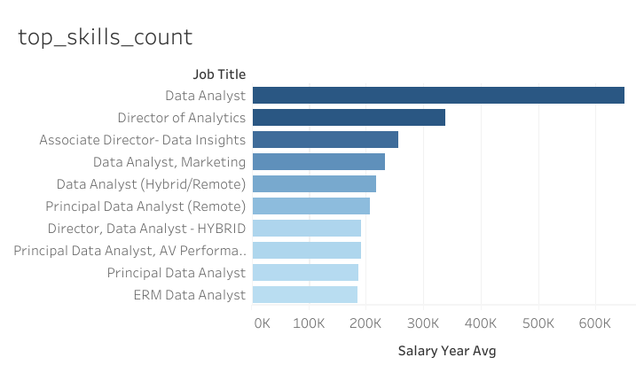
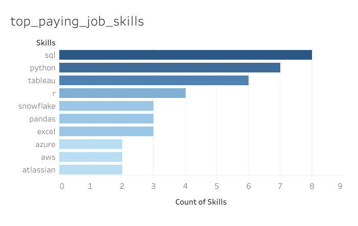

# Introduction

This is a deep dive into the current job market for Data Analyst. 

Discover the most popular and in-demand skills 🔥, characteristics of Data Analyst jobs with higher paying salaries and general insights to help new Data Analysts with well informed career development 📊.

Check out my SQL queries [project_sql folder](/project_sql/): 💻🔍

# Backgrounds
This project was conducted to start building a roadmap for my data/ business analytics career. To not only find optimal jobs for me but jobs that are highly valued by employers.

Data provide by [SQL Course](https://lukebarousse.com/sql). It's packed with insights
on job titles, salaries, locations, and essential skills.

### The questions I wanted to answer through my SQL queries were:
1. What are the top-paying data analyst jobs? 
2. What skills are required for these top-paying jobs?
3. What skills are most in demand for data
analysts?
4. Which skills are associated with higher salaries?
5. What are the most optimal skills to learn?

# What Tools I Used
- **SQL:** programming language used to transform, modify and extract data from multiple databases

- **PostgreSQL:** database management system to handle all job posting data

- **Visual Studio:** chosen editor and database manager to create queries and interact with data 

- **Github & [Git](https://git-scm.com/):** critical for project version control, tracking changes and sharing insights/ queries on a public platform

# The Analysis
Each query looks at certain aspects of the job market for data analysts exploring high valued jobs and skills based on various metrics such as high paying salaries, in demand skills, with remote work options.

### 1. Top paying Data Analyst jobs
Data was extracted for the top paying data analyst roles, regardless of other Job metrics such as skills and job demand
```sql
-- selected the most important columns and removed NULL salary values
SELECT
    job_id,
    job_title_short,
    company_dim.name AS company_name,
    job_location,
    job_schedule_type,
    salary_year_avg,
    job_posted_date
FROM job_postings_fact
-- If would be interesting to add company information so lets add left join
-- then add company name in the SELECT section above ^^
LEFT JOIN company_dim ON job_postings_fact.company_id = company_dim.company_id
WHERE
    salary_year_avg IS NOT NULL
    AND job_title_short = 'Data Analyst'
    AND job_location LIKE '%Anywhere%'
ORDER BY
    salary_year_avg DESC
LIMIT 10
```

#### Key insights:
- **Outlier Salaries:** Top 10 highest paying jobs ranged significantly from $184,000 to $650,000 USD
- **The Job Titles varied** significantly and found no common trends among specialization and salary
- **The Companies also varied** significantly from Meta to Smart Asset, indicating a valued interest in data analysts in multiple industries

<br>



_A bar graph showing the top 10 results from highest paying annual salaries, generated using Tableau_

### 2. Top paying job skills
Finding the most popular skills that are associated with highest paying annual salaries. This helps understand what skills employers value for high compensation roles.

```sql
WITH top_paying_jobs AS (
    SELECT
        job_id,
        job_title_short,
        salary_year_avg,
        company_dim.name
    FROM job_postings_fact
    LEFT JOIN company_dim ON job_postings_fact.company_id = company_dim.company_id
    WHERE
        salary_year_avg IS NOT NULL
        AND job_title_short = 'Data Analyst'
        AND job_location LIKE '%Anywhere%'
    ORDER BY
        salary_year_avg DESC
    LIMIT 10
)

SELECT
    top_paying_jobs.*,
    skills
FROM top_paying_jobs
-- We want to join top_paying_jobs data and skills data and we rows with NULL skills, therefore INNER JOIN
INNER JOIN skills_job_dim ON top_paying_jobs.job_id = skills_job_dim.job_id
INNER JOIN skills_dim ON skills_job_dim.skill_id = skills_dim.skill_id
ORDER BY salary_year_avg DESC
```

#### Key insights:
- **SQL** is the most commonly highest paid skill with a count of 8
- **Python** is also very frequently a high paying skill with a count of 7
- **Tableau & Others:** Generally speaking, tableau and other tools such as snowflake make up the remainder of the list of high paying skills

<br>



*A bar graph visualising the top 10 highest paid skills as a data analyst, generated using Tableau*

### 3. Most popular skills
Exploring the most in demand and popular skills for data analytics.

```sql
SELECT
    skills_dim.skills,
    COUNT(skills_job_dim.skill_id) AS demand_count
FROM job_postings_fact
INNER JOIN skills_job_dim ON job_postings_fact.job_id = skills_job_dim.job_id
INNER JOIN skills_dim ON skills_job_dim.skill_id = skills_dim.skill_id
-- We're only concerned about data_analysts and work from home options
WHERE 
    job_postings_fact.job_title_short = 'Data Analyst'
    AND job_work_from_home = TRUE
-- summarize the count by skill type
GROUP BY 
    skills_dim.skills
-- Top 5 in demand skills only
ORDER BY 
    demand_count DESC
LIMIT 5
```

#### Key insights:
- **SQL & Excel** skills continue to be the most in demand skills
- **In depth technical skills:** Dedicated cloud tools for story telling such as Tableau/ PowerBI and more technical skills such as Python seem to be the skills Data Analyst should learn to expand their skills and versatility once mastering spreadsheets and SQL.

<br>

| skills   | demand_count |
|----------|--------------|
| sql      | 7291         |
| excel    | 4611         |
| python   | 4330         |
| tableau  | 3745         |
| power bi | 2609         |

### 4. Average salary per skill
Exploring the average salaries per skillset to confirm general salary expectations per job role.

```sql
SELECT
    skills_dim.skills,
    ROUND(AVG(salary_year_avg), 0) AS avg_salary
FROM job_postings_fact
INNER JOIN skills_job_dim ON job_postings_fact.job_id = skills_job_dim.job_id
INNER JOIN skills_dim ON skills_job_dim.skill_id = skills_dim.skill_id
WHERE 
    job_postings_fact.job_title_short = 'Data Analyst'
    AND salary_year_avg IS NOT NULL
    AND job_work_from_home = TRUE
GROUP BY 
    skills_dim.skills
ORDER BY 
    avg_salary DESC
LIMIT 25
```

#### Key insights:
- **Variety of Big Data and ML Tools:** the top 25 highest paid skills includes specific tools used for Big Data (Couchbase), Machine Learning (Jupyter, DataTobot), and large data processing tools and python packages (Pandas and NumPy)
- **Data Engineering and Deployments:** Numerous top paying skills include development tools related to data engineerings and pipelining (Kubernetes, GitLab, Airflow)
- **Cloud Data Tools:** A significant number cloud computing tools (Databricks and GCP) are dependent on programming languages such as SQL and Python

<br>

| skills         | avg_salary |
|----------------|------------|
| pyspark        | 208172     |
| bitbucket      | 189155     |
| couchbase      | 160515     |
| watson         | 160515     |
| datarobot      | 155486     |
| gitlab         | 154500     |
| swift          | 153750     |
| jupyter        | 152777     |
| pandas         | 151821     |
| elasticsearch | 145000     |
| golang         | 145000     |
| numpy          | 143513     |
| databricks     | 141907     |
| linux          | 136508     |
| kubernetes     | 132500     |
| atlassian      | 131162     |
| twilio         | 127000     |
| airflow        | 126103     |
| scikit-learn   | 125781     |
| jenkins        | 125436     |
| notion         | 125000     |
| scala          | 124903     |
| postgresql     | 123879     |
| gcp            | 122500     |
| microstrategy  | 121619     |

### 5. Optimal skills
Insights from Queries 3 and 4 were combined to find the ideal balance between high paying and in demand Jobs. This offers a well informed guide to attain high-demand and also high-salary paying skills.
```sql
-- QUERY 3 (top skills), removing LIMIT, ORDER BY, add skill_id to SELECT and change GROUP BY to skill_id
    WITH skills_demand AS (
    SELECT
        skills_dim.skill_id,
        skills_dim.skills,
        COUNT(skills_job_dim.skill_id) AS demand_count
    FROM job_postings_fact
    INNER JOIN skills_job_dim ON job_postings_fact.job_id = skills_job_dim.job_id
    INNER JOIN skills_dim ON skills_job_dim.skill_id = skills_dim.skill_id
    WHERE 
        job_postings_fact.job_title_short = 'Data Analyst'
        AND job_work_from_home = TRUE
        AND salary_year_avg IS NOT NULL
    GROUP BY 
        skills_dim.skill_id
    ORDER BY 
        demand_count DESC
)

-- QUERY 4 (highest paying skills), removing LIMIT, ORDER BY and add skill_id  to SELECT and change GROUP BY to skill_id
, average_salary AS (
    SELECT
        skills_job_dim.skill_id,
        ROUND(AVG(salary_year_avg), 0) AS avg_salary
    FROM job_postings_fact
    INNER JOIN skills_job_dim ON job_postings_fact.job_id = skills_job_dim.job_id
    INNER JOIN skills_dim ON skills_job_dim.skill_id = skills_dim.skill_id
    WHERE 
        job_postings_fact.job_title_short = 'Data Analyst'
        AND salary_year_avg IS NOT NULL
        AND job_work_from_home = TRUE
    GROUP BY 
        skills_job_dim.skill_id
    ORDER BY 
        avg_salary DESC
)


SELECT
    skills_demand.skill_id,
    skills_demand.skills,
    demand_count,
    avg_salary
FROM
    skills_demand
INNER JOIN average_salary ON skills_demand.skill_id = average_salary.skill_id
WHERE
    demand_count > 10
ORDER BY
    avg_salary DESC,
    demand_count DESC
LIMIT 25
```
Results were sorted by highest paying jobs in descending order, but to remove outliers and ensure jobs were of high demand, skills was to only include results with 10 or more counts.

#### Key insights:
- **High-Demand Programming Languages:** Python and R stand out for their high demand, with demand counts of 236 and 148 respectively. Despite their high demand, their average salaries are around $101,397 for Python and $100,499 for R, indicating that proficiency in these languages is highly valued but also widely available.
- **Cloud Tools and Technologies:** Skills in specialized technologies such as Snowflake, Azure, AWS, and BigQuery show significant demand with relatively high average salaries, pointing towards the growing importance of cloud platforms and big data technologies in data analysis.
- **Business Intelligence and Visualization Tools:** Tableau and Looker, with demand counts of 230 and 49 respectively, and average salaries around $99,288 and $103,795, highlight the critical role of data visualization and business intelligence in deriving actionable insights from data.
- **Database Technologies:** The demand for skills in traditional and NoSQL databases (Oracle, SQL Server, NoSQL) with average salaries ranging from $97,786 to $104,534, reflects the enduring need for data storage, retrieval, and management expertise.

<br>

| skill_id | skills      | demand_count | avg_salary |
|----------|-------------|--------------|------------|
| 8        | go          | 27           | 115320     |
| 234      | confluence  | 11           | 114210     |
| 97       | hadoop      | 22           | 113193     |
| 80       | snowflake   | 37           | 112948     |
| 74       | azure       | 34           | 111225     |
| 77       | bigquery    | 13           | 109654     |
| 76       | aws         | 32           | 108317     |
| 4        | java        | 17           | 106906     |
| 194      | ssis        | 12           | 106683     |
| 233      | jira        | 20           | 104918     |
| 79       | oracle      | 37           | 104534     |
| 185      | looker      | 49           | 103795     |
| 2        | nosql       | 13           | 101414     |
| 1        | python      | 236          | 101397     |
| 5        | r           | 148          | 100499     |
| 78       | redshift    | 16           | 99936      |
| 187      | qlik        | 13           | 99631      |
| 182      | tableau     | 230          | 99288      |
| 197      | ssrs        | 14           | 99171      |
| 92       | spark       | 13           | 99077      |
| 13       | c++         | 11           | 98958      |
| 7        | sas         | 63           | 98902      |
| 186      | sas         | 63           | 98902      |
| 61       | sql server  | 35           | 97786      |
| 9        | javascript  | 20           | 97587      |

# What I Learned
Throughout this project journey, I learned the foundational components of SQL and the most commonly used functions. 

- **Advanced SQL techniques:** Building multiple small queries helped me understand how complex queries should be constructed. From joining tables and using WITH clauses in a logical fashion.

- **Data Aggregation:** Getting comfortable with GROUP BY and aggregating data effectively with SUM, AVG and COUNT functions.

-**Expanding kowledge of data tools:** Learning how to navigate through Visual Studio, Github, git and PostgreSQL and how they all interact.

-**Converting data into Information:** Transforming data into easily digestable information that answered the key questions of this project using SQL proficiently.

Common skills that appeared throughout this analysis that seem to be foundational for high demand and high paying salaries included.

# Conclusion
In the current Job market here are the main emerging skills to focus:

1. **Top-Paying Data Analyst Jobs**: The highest-paying jobs for data analysts that allow remote work offer a wide range of salaries, the highest at $650,000!
2. **Skills for Top-Paying Jobs**: High-paying data analyst jobs require advanced proficiency in SQL, suggesting it's a critical skill for earning a top salary.
3. **Most In-Demand Skills**: SQL is also the most demanded skill in the data analyst job market, thus making it essential for job seekers.
4. **Skills with Higher Salaries**: Specialized skills, such as SVN and Solidity, are associated with the highest average salaries, indicating a premium on niche expertise.
5. **Optimal Skills for Job Market Value**: SQL leads in demand and offers for a high average salary, positioning it as one of the most optimal skills for data analysts to learn to maximize their market value.
